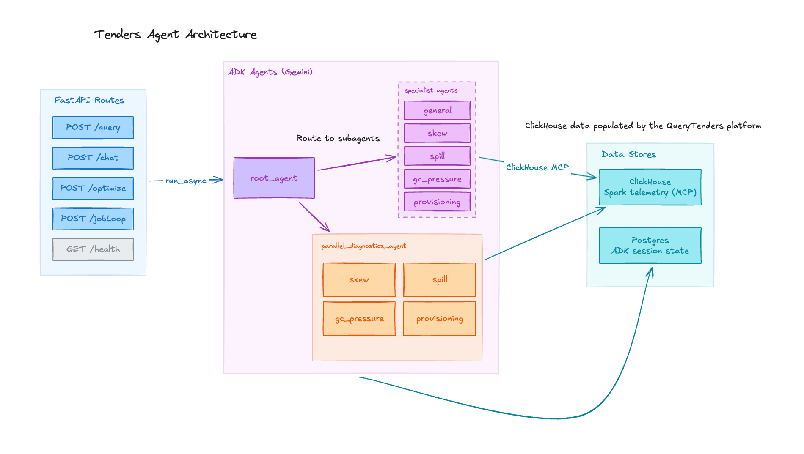

# QueryTenders Agent

QueryTenders Agent is an AI performance engineer for Apache Spark workloads. It turns raw Spark telemetry into practical answers: what slowed down, where it happened, whether the job is skewed or spilling, how much garbage collection is hurting runtime, and what configuration change should be tried next.

Built for the Google Cloud for Startups hackathon's [New Agents category](https://devpost.team/google-cloud-for-startups/hackathons/3197), the agent is designed to sit beside a data engineer while they work. It can reason from the current file context, inspect historical Spark telemetry through ClickHouse, route questions to focused diagnostic specialists, and return evidence-backed optimization guidance through a simple API.

## What It Does

- Answers natural-language questions about Spark applications, jobs, stages, SQL executions, and runtime behavior.
- Routes each request to the right diagnostic specialist for skew, spilling, JVM GC pressure, provisioning, or general telemetry analysis.
- Runs comprehensive reviews across multiple specialists when the user asks for root cause analysis.
- Uses source-attribution fields to connect telemetry back to the PySpark file, JVM main class, call site, or Spark SQL plan origin that produced the work.
- Supports an optimization loop endpoint that can recommend the next Spark configuration from prior run context.
- Persists ADK sessions so multi-turn conversations can retain continuity across API requests.

## Why It Matters

Spark performance tuning is usually scattered across logs, event histories, SQL plans, dashboards, and tribal knowledge. QueryTenders Agent brings those signals into one conversational workflow. Instead of asking an engineer to manually compare task distributions, shuffle volume, spill bytes, executor sizing, and GC time, the agent delegates to specialist agents and summarizes the evidence in the language of Spark operations.

## Architecture



The service is a FastAPI app that hosts a Google ADK runner. A root ADK agent receives each user request, preserves the current-file context, and delegates the question to the best sub-agent.

Core flow:

1. A client sends a Spark question to `/query`, `/chat`, `/optimize`, or `/jobLoop`.
2. FastAPI validates the request and hands it to the ADK `Runner`.
3. The root `tenders_agent` decides which specialist should handle the request.
4. Specialist agents query ClickHouse through an MCP toolset to inspect Spark telemetry.
5. ADK streams events back to the service, and the final response is returned to the client.
6. Session state is stored through ADK's `DatabaseSessionService` so future turns can continue the investigation.

Specialist agents:

- `general_agent`: broad telemetry questions, run summaries, SQL history, regressions, and schema exploration.
- `skew_agent`: task imbalance, partition skew, stragglers, and uneven shuffle distribution.
- `spill_agent`: memory spill, disk spill, shuffle spill, expensive joins, and aggregation pressure.
- `gc_pressure_agent`: JVM garbage collection overhead, heap pressure, and executor runtime loss.
- `provisioning_agent`: executor count, core count, memory sizing, dynamic allocation, queue delay, and over/under-provisioning.
- `parallel_diagnostics_agent`: comprehensive diagnosis across skew, spill, GC, and provisioning specialists.

## ADK Features Used

- `Agent` for the root router and each Spark diagnostics specialist.
- `ParallelAgent` for concurrent comprehensive reviews across multiple specialists.
- `SequentialAgent` as a runtime-selectable fallback when sequential diagnostics are preferred.
- `sub_agents` for hierarchical delegation from the router to domain experts.
- `MCPToolset` and `StdioConnectionParams` to connect ADK agents to ClickHouse through the Model Context Protocol.
- `Runner.run_async()` for async event-driven agent execution from the FastAPI service.
- `DatabaseSessionService` for persistent ADK sessions, events, app state, and user state.
- Gemini model integration through ADK, including retry settings for transient model or quota failures.
- `output_key` on parallel specialists so comprehensive diagnostics can preserve structured intermediate findings.

## API Surface

- `GET /health`: service healthcheck.
- `POST /query`: authenticated agent query endpoint for production-style clients.
- `POST /chat`: chat-oriented endpoint that accepts lightweight conversation history.
- `POST /optimize`: single-prompt optimization endpoint.
- `POST /jobLoop`: optimization loop endpoint that can return a validated Spark configuration and continue/stop signal.

## Development

Install dependencies and run the service locally:

```bash
uv sync
uv run tenders-agent
```

Check the service:

```bash
curl http://localhost:8001/health
```

Configuration is read from environment variables or a local `.env` file. Use real values only in your local environment or secret manager; do not commit them.

```bash
POSTGRES_URL="postgresql+asyncpg://<user>:<password>@<host>:<port>/<database>"
API_KEY_POSTGRES_URL="postgresql://<user>:<password>@<host>:<port>/<database>"

CLICKHOUSE_MCP_COMMAND="mcp-clickhouse"
CLICKHOUSE_HOST="<clickhouse-host>"
CLICKHOUSE_PORT="8123"
CLICKHOUSE_USER="<clickhouse-user>"
CLICKHOUSE_PASSWORD="<clickhouse-password>"
CLICKHOUSE_DATABASE="<database>"
CLICKHOUSE_SECURE="true"
CLICKHOUSE_VERIFY="true"

GEMINI_MODEL="gemini-flash-latest"
PARALLEL_COMPREHENSIVE_DIAGNOSTICS="true"
```

`/query` expects an `X-API-Key` header. The service validates the raw key by hashing it with SHA-256 and checking it against a backend `api_keys` table, including revoked and expiration checks.

Example request:

```bash
curl -X POST http://localhost:8001/chat \
  -H "Content-Type: application/json" \
  -d '{"message":"Why was my latest Spark job slow?"}'
```
